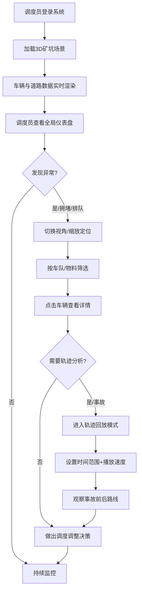

## 1. 产品概述

露天矿卡车道路三维调度可视化系统，基于 Three.js 构建沉浸式 3D 场景，为矿山调度员提供实时车辆位置、装卸状态、道路拥堵、安全风险等全景监控能力，支持昼夜切换、车队过滤、轨迹回放等交互功能，显著提升调度效率与安全生产水平。

- **核心目标**：将露天矿复杂的运输调度数据以三维可视化方式呈现，辅助调度员实时决策
- **目标用户**：矿山调度中心调度员、安全管理人员、生产运营主管

---

## 2. 核心功能

### 2.1 用户角色

| 角色 | 使用方式 | 核心权限 |
|------|----------|----------|
| 调度员 | 实时监控+调度指挥 | 全景查看、车辆过滤、轨迹回放、事故分析 |
| 安全管理员 | 安全巡查 | 危险边坡、安全距离、限速区域监控 |
| 运营主管 | 效率分析 | 装卸效率、排队长度、车队绩效 |

### 2.2 功能模块

1. **3D 矿坑场景**：台阶地形、运输道路网络、装载点、卸料区、挖机作业面、危险边坡警戒区
2. **车辆调度系统**：卡车实时位置与移动、载重状态标签、挖机作业状态、排队长度可视化
3. **道路信息层**：坡度标识、限速标牌、坡道方向箭头、道路拥堵热力色、安全距离警戒线
4. **昼夜系统**：白班（自然光照）与夜班（路灯照明+车灯）一键切换，含过渡动画
5. **筛选控制**：按车队（颜色区分）、物料类型（煤/矿石/废石）过滤显示
6. **轨迹回放**：单车历史轨迹查看、事故前后时间段路线回放、播放控制条
7. **性能优化**：卡车数量多时自动降级为简化模型（LOD）、轨迹点抽样渲染
8. **信息面板**：车辆详情悬浮卡、全局统计仪表盘（在途车辆、排队长度、装卸效率、安全预警）

### 2.3 页面详情

| 页面名称 | 模块名称 | 功能描述 |
|----------|----------|----------|
| 主调度视图 | 3D 场景画布 | Three.js 渲染矿坑全貌，支持轨道控制（旋转/缩放/平移），鼠标悬停显示车辆信息，点击选中车辆 |
| 主调度视图 | 顶部工具栏 | 昼夜切换开关、车队筛选下拉、物料类型筛选、视图预设（俯视/斜视/主运输道） |
| 主调度视图 | 左侧信息面板 | 全局统计卡片：在途车辆数、平均载重、排队总长度、今日装卸效率、安全预警数 |
| 主调度视图 | 右侧回放面板 | 时间轴滑块、播放/暂停按钮、速度倍率（0.5x/1x/2x/4x）、事故书签列表 |
| 主调度视图 | 底部图例栏 | 道路层级色卡、车辆类型图例、物料颜色图例、危险等级标识 |
| 主调度视图 | 车辆悬浮卡 | 悬停车辆显示：车牌号、所属车队、载重吨数、当前速度、下一路口、预计到达时间 |
| 主调度视图 | 选中车辆详情 | 点击车辆后固定面板：基本信息 + 完整轨迹线 + 当日装卸记录 |

---

## 3. 核心流程

调度员日常工作流程：打开系统 → 查看全局运力与排队情况 → 切换视角观察瓶颈路段 → 过滤特定车队排查 → 点击异常车辆查看轨迹 → 若有事故则回放分析 → 做出调度决策。

---

## 4. 用户界面设计

### 4.1 设计风格

- **设计主题**：工业科技风（Industrial Tech），深色基调配合高饱和警示色，营造专业调度指挥中心氛围
- **主色调**：深空蓝 `#0A1628`（背景）、钢铁灰 `#1E2A3A`（面板）、矿橙 `#FF7A1A`（强调）
- **辅助色**：煤黑 `#1A1A1A`（煤料）、铁红 `#C23B22`（矿石）、石灰绿 `#6B8E23`（废石）
- **警示色**：安全红 `#E53935`（危险）、限速黄 `#FFB300`（警告）、畅通绿 `#43A047`（正常）
- **按钮样式**：硬朗切角矩形，2px 描边，悬停发光效果
- **字体**：展示字体 `Orbitron`（数字仪表盘）、正文字体 `Noto Sans SC`（中文信息）
- **布局风格**：深色玻璃拟态面板（半透明 + 模糊背景），四周信息面板环绕中央 3D 画布
- **图标风格**：线性工业图标 + 实体 3D 模型标识结合

### 4.2 页面设计概览

| 页面名称 | 模块名称 | UI 元素 |
|----------|----------|---------|
| 主调度视图 | 3D 画布 | 全景透视摄像机、定向光+环境光（白班）/点光源阵列+车灯（夜班）、雾效、阴影贴图 |
| 主调度视图 | 顶部工具栏 | 玻璃面板、切角开关按钮、图标+文字组合、下拉筛选器发光边框 |
| 主调度视图 | 左侧仪表盘 | 卡片网格布局、Orbitron 大字号数字、环形进度条、微升序动画 |
| 主调度视图 | 右侧回放面板 | 时间轴（可拖拽双滑块）、播放控制按钮组、速度倍率切换、书签列表 |
| 主调度视图 | 底部图例 | 水平色卡条、色块+文字、悬停放大效果 |
| 主调度视图 | 车辆标签 | CSS2DRenderer 精灵标签、动态不随缩放消失、发光边框、实时数据更新 |
| 主调度视图 | 警戒线 | 半透明红色发光平面 + 闪烁动画、危险边坡区域红色脉冲边框 |

### 4.3 响应式设计

- **策略**：桌面优先（调度中心大屏/双屏为主），同时兼容 1366×768 及以上分辨率
- **面板自适应**：左侧和右侧面板在窗口宽度小于 1280px 时自动折叠为抽屉式，由两侧悬浮按钮呼出
- **工具栏**：小屏时图标模式优先，文字作为 tooltip
- **触控优化**：3D 画布支持多指捏合缩放、双指平移、单指旋转

### 4.4 3D 场景指导

- **环境与氛围**：
  - 白班：HDRI 晴朗天空（或程序化渐变天空），暖白色定向光模拟太阳，投射柔和阴影，轻微体积雾增强深度
  - 夜班：深蓝紫渐变天空，场景低环境光，部署路灯阵列（warm point light with decay），每辆卡车头灯 2 盏聚光灯，尾灯红色点光源
- **光照配置**：
  - 白班主光：DirectionalLight 强度 1.2，阴影 mapSize 2048×2048，cascaded 分区
  - 白班辅光：HemisphereLight 天空蓝/地面棕，强度 0.4
  - 夜班主光：AmbientLight 强度 0.08 保持暗部可见
  - 夜道路灯：PointLight 每 50m 一个，颜色 `#FFD27F`，强度 2.0，距离 60，decay 2.0
  - 卡车车灯：SpotLight 角度 Math.PI/7，penumbra 0.3，距离 80
- **摄像机**：
  - 初始：PerspectiveCamera fov=55，位置 (180, 140, 180)，LookAt 矿坑中心
  - 控制：OrbitControls，minDistance=30，maxDistance=500，启用阻尼
  - 预设视角按钮：俯视(0, 300, 0.1)、斜视(180,140,180)、主运输道跟随
- **构图与焦点**：
  - 矿坑为下凹式盆地结构，中心最低（工作面），四周逐级升高台阶
  - 主运输道螺旋上升，视觉引导线从装载点通往卸料区
  - 关键节点（装载/卸料区）放置大号标识柱 + 发光标签
- **交互与动画**：
  - 车辆：沿 CatmullRom 曲线采样点移动，车头朝切线方向，车轮滚动
  - 挖机：大臂缓慢上下+左右回转周期动画，铲斗开合
  - 警戒线：pulse 脉冲式透明度呼吸（0.3↔0.8，周期 2s）
  - 昼夜切换：1.5s 渐变过渡，光照强度与天空色插值变化
- **后处理**：
  - Bloom（泛光）：阈值 0.8，强度 0.6（夜班增强至 1.2，突出路灯车灯）
  - FXAA 抗锯齿
  - 色调映射 ACESFilmic
- **资源与性能预算**：
  - 纯程序化生成（BoxGeometry + ExtrudeGeometry 等），无外部模型依赖
  - 卡车 LOD：近距离（<80）高模（15 面）、中距离（80-180）中模（8 面）、远距离（>180）低模（立方体+色块，2 面）
  - 车辆上限：200 辆（测试场景默认 60 辆）
  - 目标帧率：稳定 60fps（桌面端）/ 30fps（移动端）

---

## 5. 非功能性需求

| 类别 | 指标 |
|------|------|
| 性能 | 60 辆车同时移动 ≥ 60fps；200 辆车（LOD 降级）≥ 45fps |
| 交互响应 | 悬停车辆标签 < 50ms 出现；昼夜切换过渡 < 2s |
| 兼容性 | Chrome 100+ / Edge 100+ / Firefox 95+；WebGL 2.0 |
| 可扩展 | 车辆模型、道路数据、调度规则均配置化，易接入真实数据接口 |
