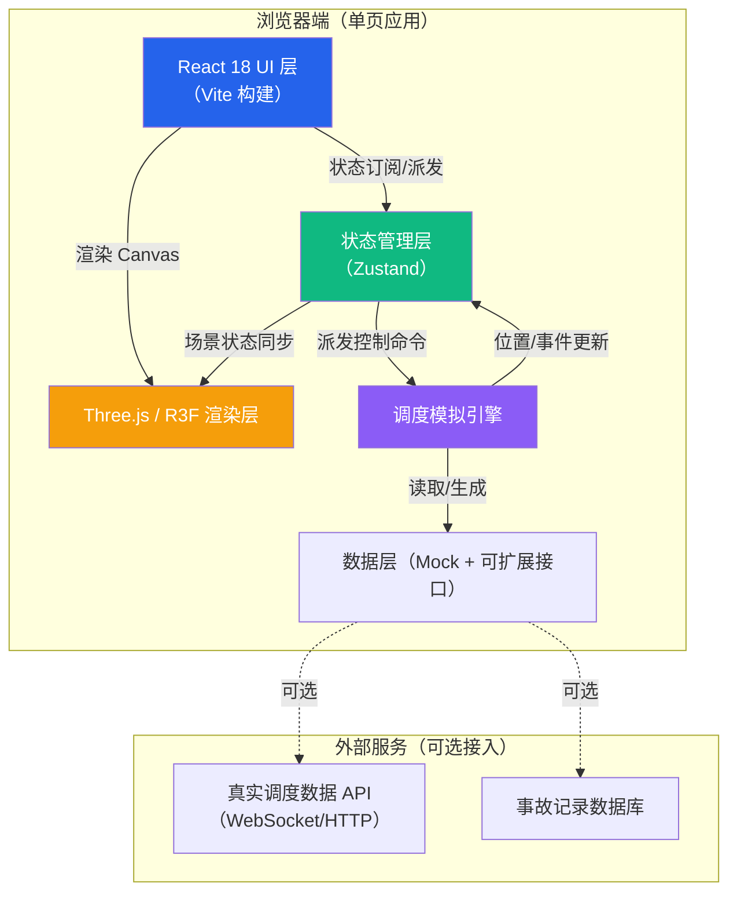
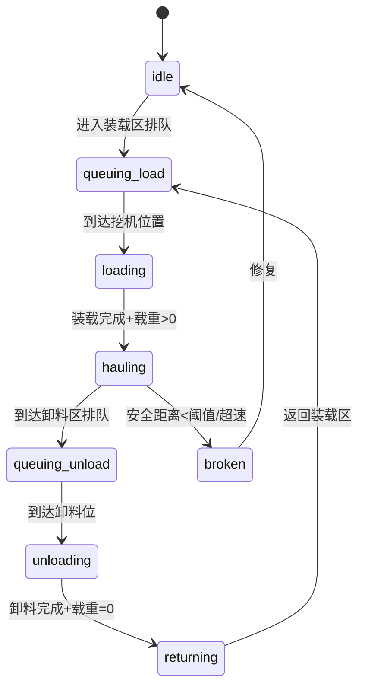

## 1. 架构设计



**分层说明：**
- **React UI 层**：负责控制面板、仪表盘、图例、回放时间轴等 2D 交互界面，组件化开发
- **Three.js 渲染层**：负责 3D 场景渲染、相机控制、光照后处理、拾取（Raycaster）交互
- **Zustand 状态管理层**：集中管理昼夜状态、筛选条件、选中车辆、回放进度、全局统计数据，跨组件/跨层共享
- **调度模拟引擎**：独立于渲染循环的模拟 tick，负责计算车辆沿轨迹的位置、装卸状态、排队逻辑、事故事件
- **数据层**：内置 Mock 数据生成器（道路网络、车辆配置、历史轨迹），同时预留真实调度系统接口接入层

---

## 2. 技术选型说明

| 层级 | 技术栈 | 版本 | 选型理由 |
|------|--------|------|----------|
| 前端框架 | React | ^18.2.0 | 生态成熟，Hooks 便于组合渲染层与 UI 层 |
| 构建工具 | Vite | ^5.0.0 | 极速 HMR，支持 import.meta.glob，开箱即用的 React + TS 模板 |
| 语言 | TypeScript | ^5.3.0 | 大型项目类型安全，车辆/道路/调度数据模型清晰 |
| 3D 核心 | three | ^0.160.0 | 主流 WebGL 引擎，性能优秀，文档完善 |
| React-3D 桥接 | @react-three/fiber | ^8.15.0 | 以声明式方式编写 Three.js 场景，与 React 生态无缝融合 |
| 3D 辅助库 | @react-three/drei | ^9.92.0 | 提供 OrbitControls、HTML（CSS2D）、Text、Sky、Stars 等常用组件 |
| 后处理 | @react-three/postprocessing | ^2.15.0 | 封装 EffectComposer，方便实现 Bloom/FXAA 等效果 |
| 状态管理 | zustand | ^4.4.0 | 轻量无 boilerplate，支持订阅切片，跨层共享不阻塞渲染 |
| 样式方案 | tailwindcss | ^3.4.0 | 原子化 CSS，快速构建工业风面板，与设计系统契合 |
| UI 组件 | @radix-ui/react-*（按需） | ^1.0.0 | 无障碍、无样式的基础组件（Dropdown、Slider、Switch），便于深度定制 |
| 时间处理 | dayjs | ^1.11.0 | 轻量，回放时间轴格式化 |
| 后端 | **无（纯前端 Mock）** | - | 项目核心为可视化展示，数据由内置模拟引擎生成，后续可扩展接入真实 API |

---

## 3. 路由定义

| 路由路径 | 页面组件 | 用途说明 |
|----------|----------|----------|
| `/` | `MainDashboard` | 主调度视图（唯一页面，含 3D 场景+四周面板） |

> 项目为单视图应用，所有功能模块在同一页面内通过面板切换/抽屉展开实现，不设置多级路由。

---

## 4. 目录结构

```
src/
├── components/                # React UI 组件（2D 面板）
│   ├── layout/
│   │   ├── TopToolbar.tsx        # 顶部工具栏（昼夜切换/筛选/视角预设）
│   │   ├── LeftDashboard.tsx     # 左侧仪表盘（统计卡片）
│   │   ├── RightReplayPanel.tsx  # 右侧回放面板（时间轴/速度/书签）
│   │   └── BottomLegend.tsx      # 底部图例栏
│   ├── vehicle/
│   │   ├── VehicleTooltip.tsx    # 车辆悬浮信息卡（R3F <Html>）
│   │   └── VehicleDetail.tsx     # 选中车辆详情面板
│   └── ui/                       # Radix 封装的基础组件（Switch/Slider/Dropdown）
├── scene/                     # R3F 3D 场景组件
│   ├── MineTerrain.tsx           # 矿坑台阶地形
│   ├── RoadNetwork.tsx           # 运输道路（层级色/坡度/限速/方向箭头/拥堵色）
│   ├── LoadingPoints.tsx         # 装载点+挖机
│   ├── UnloadingAreas.tsx        # 卸料区
│   ├── DangerZones.tsx           # 危险边坡警戒线
│   ├── StreetLights.tsx          # 路灯阵列
│   ├── Truck.tsx                 # 单辆卡车（含 LOD + 车灯 + 标签）
│   ├── TruckFleet.tsx            # 卡车批量管理（InstancedMesh 远距优化）
│   ├── DayNightCycle.tsx         # 昼夜系统（光照/天空/Bloom 强度插值）
│   └── Scene.tsx                 # 场景根组件（Canvas + Controls + Lights）
├── store/                     # Zustand 状态
│   ├── useScheduleStore.ts       # 调度全局状态（车辆/筛选/昼夜/回放）
│   └── selectors.ts              # 性能优化：订阅切片
├── simulation/                # 调度模拟引擎（独立于渲染）
│   ├── types.ts                  # 数据模型类型定义
│   ├── roadData.ts               # 道路网络与节点（mock 数据）
│   ├── vehicleFactory.ts         # 车辆与挖机初始数据生成
│   ├── scheduler.ts              # 车辆移动/排队/装卸状态机
│   └── replayRecorder.ts         # 轨迹记录与事故抽样
├── utils/                     # 工具函数
│   ├── colors.ts                 # 颜色常量（工业色板）
│   ├── lod.ts                    # LOD 距离阈值与降级策略
│   └── perf.ts                   # 帧率监控与降级触发
├── styles/
│   └── globals.css               # Tailwind 入口 + 自定义玻璃面板样式
├── App.tsx                    # 根组件
└── main.tsx                   # Vite 入口
```

---

## 5. 核心数据模型

### 5.1 类型定义（TypeScript）

```typescript
// ===== 道路网络 =====
interface RoadNode {
  id: string;
  x: number; y: number; z: number;   // 3D 坐标（y 为高度，体现坡度）
}
interface RoadSegment {
  id: string;
  from: string; to: string;          // 连接 RoadNode.id
  level: 0 | 1 | 2 | 3;              // 道路层级：0=主道 1=次道 2=支路 3=工作道
  slope: number;                     // 坡度（百分比）
  speedLimit: number;                // 限速 km/h
  direction: 'up' | 'down' | 'flat'; // 坡道方向
  congestionLevel: 0 | 1 | 2 | 3;    // 拥堵等级：0畅通 1缓行 2拥堵 3堵塞
  dangerZone?: boolean;              // 是否临近危险边坡
  length: number;                    // 段长（米，预计算）
}

// ===== 车辆 =====
type MaterialType = 'coal' | 'ore' | 'waste';
type Fleet = 'A' | 'B' | 'C' | 'D';
type TruckStatus = 'idle' | 'loading' | 'hauling' | 'queuing_load' | 'queuing_unload' | 'unloading' | 'returning' | 'broken';

interface Truck {
  id: string;
  plateNo: string;                   // 车牌号
  fleet: Fleet;                      // 所属车队
  capacity: number;                  // 额定载重（吨）
  load: number;                      // 当前载重（吨）
  material: MaterialType | null;     // 装载物料类型
  status: TruckStatus;
  speed: number;                     // 当前速度（km/h，模拟）
  currentSegmentId: string | null;   // 行驶道路段
  progressOnSegment: number;         // 在当前段的进度 [0,1]
  position: { x: number; y: number; z: number }; // 实时坐标
  heading: number;                   // 朝向角（弧度）
  distanceToNext: number;            // 与前车距离（米，安全距离监控）
  safetyAlert?: 'too_close' | 'overspeed' | null;
  currentLoadingPointId?: string;
  currentUnloadingAreaId?: string;
  queueRank?: number;                // 排队序号（1=排头）
  etaNextNode?: number;              // 预计到达下节点耗时（秒）
}

interface Excavator {
  id: string;
  name: string;
  loadingPointId: string;
  efficiency: number;                // 装车效率（吨/小时）
  swingAngle: number;                // 当前回转角（动画用）
  armPitch: number;                  // 大臂俯仰（动画用）
  bucketOpen: number;                // 铲斗开合 [0,1]
  cycleCount: number;                // 当日装车次数
}

// ===== 装载点 / 卸料区 =====
interface LoadingPoint {
  id: string;
  name: string;
  position: { x: number; y: number; z: number };
  material: MaterialType;
  excavatorId: string;
  queue: string[];                   // 排队卡车 id 列表
  avgWaitTime: number;               // 平均等待时间（分钟）
}
interface UnloadingArea {
  id: string;
  name: string;
  position: { x: number; y: number; z: number };
  accepts: MaterialType[];
  queue: string[];
  avgWaitTime: number;
}

// ===== 回放 =====
interface TrackSample {
  t: number;                         // 相对时间戳（秒）
  x: number; y: number; z: number;
  status: TruckStatus;
  load: number;
  speed: number;
}
interface AccidentBookmark {
  id: string;
  truckId: string;
  timestamp: number;                 // 绝对时间
  type: 'collision' | 'overspeed' | 'road_edge' | 'other';
  description: string;
}

// ===== 全局状态 =====
interface ScheduleState {
  trucks: Record<string, Truck>;
  excavators: Record<string, Excavator>;
  loadingPoints: Record<string, LoadingPoint>;
  unloadingAreas: Record<string, UnloadingArea>;
  roadSegments: Record<string, RoadSegment>;

  // 控制状态
  isNight: boolean;                  // 昼夜
  fleetFilter: Fleet | 'all';        // 车队筛选
  materialFilter: MaterialType | 'all'; // 物料筛选
  selectedTruckId: string | null;    // 选中车辆
  hoveredTruckId: string | null;     // 悬停车辆

  // 回放状态
  isReplayMode: boolean;
  replayTruckId: string | null;
  replayTime: number;                // 当前回放时间（秒）
  replayDuration: number;            // 总时长
  replaySpeed: 0.5 | 1 | 2 | 4;
  isPlaying: boolean;
  replayTracks: Record<string, TrackSample[]>;
  bookmarks: AccidentBookmark[];

  // 统计
  stats: {
    inTransitCount: number;
    avgLoad: number;
    totalQueueLen: number;
    loadingEfficiency: number;        // 吨/小时
    safetyAlertCount: number;
    fps: number;
  };
}
```

### 5.2 核心状态转换（TruckStatus 状态机）



---

## 6. 调度模拟引擎原理

**模拟 Tick**：`setInterval(simulate, 50)`（20Hz，与渲染 60Hz 解耦），每 tick 推进 `Δt = 50ms` 的虚拟时间。

- **车辆移动**：每辆车根据 `currentSegmentId` 和 `speed` 推进 `progressOnSegment`，通过两端 `RoadNode` 线性插值出实时 `position`；到达端点后按调度规则选择下一段。
- **调度规则（默认 A* 简化版）**：从当前节点到目标（装载点/卸料区）按 `level` 高优先、`congestionLevel` 低优先选择下一节点。
- **排队逻辑**：进入装载点 20m 范围内自动加入 `queue`，`queueRank>0` 时 `status=queuing_*` 且 `speed=0`，前车走后自动前移。
- **装卸模拟**：`loading` / `unloading` 状态按 `efficiency` 线性增长/减少 `load`，满/空后切换状态。
- **事故抽样**：每 tick 以极小概率触发 `overspeed` 或 `too_close` 事件，记录时间戳到 `bookmarks`，用于回放演示。

---

## 7. 性能优化策略

| 场景 | 优化手段 | 触发条件 |
|------|----------|----------|
| 车辆数量多 | **LOD 三级切换**：近距离每辆独立 Mesh + CSS2D 标签；中距离 InstancedMesh（按车队分桶）；远距离降级为 `Points`（Sprite 点精灵） | 摄像机距离 <80 / 80-180 / >180 |
| 轨迹回放长 | **轨迹点抽样**：存储全部采样点，渲染时按距离阈值抽稀（Ramer-Douglas-Peucker 或每 N 点取 1），长轨迹默认仅显示每 5 个点 | 轨迹长度 >500 点 |
| 标签遮挡 | **CSS2DRenderer 自动裁剪**：超出视锥/被遮挡的 `opacity=0`，同时限制同时显示标签不超过 20 个 | GPU 遮挡查询 + 距离排序 |
| 夜间灯光多 | **灯光纹理烘焙**：路灯对地面的照明通过预渲染 LightMap 代替实时阴影；仅保留头灯 2 盏/车为实时光源 | 夜班模式 |
| 状态频繁更新 | **Zustand 浅比较**：UI 面板使用 `useStore(selector, shallow)` 订阅切片，避免无关重渲染 | 全场景 |
| 大量道路段 | **按 frustum 剔除**：道路段按 `RoadNode` 计算包围盒，超出视锥不渲染 Mesh | 每帧自动（Three.js 默认） |

---

## 8. 接入真实数据的扩展点

在 `src/simulation/roadData.ts`、`vehicleFactory.ts`、`scheduler.ts` 三层均留出函数接口，未来接入真实系统时：

1. 新增 `src/api/scheduleApi.ts`，封装 WebSocket + HTTP 请求；
2. 将 `roadData.ts` 中的静态 `RoadSegment[]` 改为 `fetchRoadNetwork()` Promise；
3. `scheduler.ts` 的 `simulate()` 改为：若 `liveData=true` 则跳过本地计算，直接消费 WS 推送的 `Truck.position` / `status` 更新 `useScheduleStore`。
